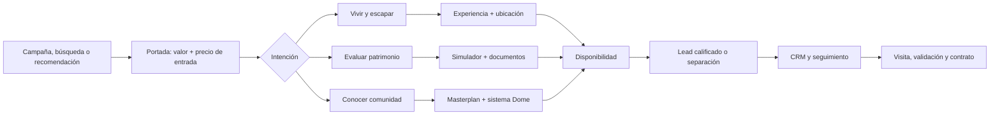

# Auditoría y plan de transformación web 2026 — Moon Paracas

Fecha de corte: 15 de julio de 2026  
Alcance: producto digital, conversión, confianza inmobiliaria, seguridad, rendimiento, accesibilidad, SEO y preparación operativa.

## 1. Resumen ejecutivo

La web tenía una propuesta visual atractiva, pero mezclaba presentación comercial, inventario, pagos y administración sin una frontera de confianza clara. El mayor riesgo no era de diseño: el navegador podía intervenir en datos de lotes y reservas, la confirmación del pago no estaba reconciliada de manera robusta y aparecían datos legales o promesas que no debían publicarse sin evidencia documental.

La intervención convierte el sitio en una experiencia de decisión, no solo en una vitrina:

- presenta tres recorridos según intención de compra;
- prioriza precio, modalidad de pago, ubicación, evidencia y proceso;
- mantiene el inventario público como lectura y reserva únicamente desde servidor;
- valida la firma del webhook y reconcilia el pago antes de confirmar;
- elimina datos legales ficticios y separa lo referencial de lo verificable;
- crea páginas legales, SEO por ruta, navegación 404 y activos ligeros para móvil;
- retira del sitio público la pantalla administrativa y el módulo de comisiones;
- añade una prueba automatizada de rutas, consola, responsive, recursos críticos y límites básicos de API.

El resultado está listo para revisión de negocio y homologación de credenciales. No debe considerarse listo para cobrar en producción hasta cerrar los bloqueos de la sección 8.

## 2. Lectura del mercado peruano

### Señales útiles

- El mercado inmobiliario peruano llega a 2026 con expectativa de mayor dinamismo, pero el comprador sigue siendo sensible al financiamiento, a la claridad de la entrega y al respaldo del promotor. Fuente de contexto: [El Peruano — perspectivas del mercado inmobiliario para 2026](https://elperuano.pe/noticia/286012-mercado-de-inmuebles-perspectivas-para-2026).
- El BCRP publica series de precio de venta y alquiler por metro cuadrado. Son la referencia correcta para futuros comparables; la web no debe inventar plusvalías ni retornos garantizados. Fuente: [BCRP — mercado inmobiliario](https://estadisticas.bcrp.gob.pe/estadisticas/series/trimestrales/mercado-inmobiliario).
- La segmentación socioeconómica debe apoyarse en variables de hogar, educación, activos y servicios, no solo en una etiqueta aspiracional. Fuente: [APEIM — niveles socioeconómicos](https://apeim.com.pe/wp-content/uploads/2025/03/2023-2024-Version-WEB.pdf.pdf).
- El turismo de Ica es principalmente nacional y Paracas tiene demanda de naturaleza consolidada. El reporte regional registró 412,424 visitantes a la Reserva Nacional de Paracas durante 2024, 89% nacionales. Fuente: [MINCETUR — Reporte Regional de Turismo Ica 2024](https://cdn.www.gob.pe/uploads/document/file/6137023/5420947-reporte-regional-de-turismo-ica-ano-2024.pdf?v=1742580000).
- En enero y febrero de 2025 la Reserva Nacional de Paracas recibió 130,856 visitantes y las Islas Ballestas 122,775. Fuente: [MINCETUR — destinos más visitados](https://www.gob.pe/institucion/mincetur/noticias/1160481-santuario-historico-de-machupicchu-fue-el-destino-turistico-mas-visitado-del-peru-en-el-primer-bimestre-de-2025).
- Para el viajero peruano, pareja, naturaleza y gastronomía son motivadores relevantes: 29% viaja con pareja, 56% busca naturaleza y 51% gastronomía en el estudio citado. Fuente: [PROMPERÚ — vacacionista nacional en pareja](https://www.promperu.gob.pe/turismoin/boletines/detalleboletin?boletin=277).

### Perfiles prioritarios

Estos perfiles son una inferencia estratégica a partir del producto, sus precios actuales y las señales anteriores; deben validarse con analítica y entrevistas.

1. **Escape con propósito — 32 a 48 años.** Pareja o familia joven de Lima, con auto y capacidad de cuota. Busca naturaleza, diseño, desconexión y un lugar propio para fines de semana. Necesita visualizar la experiencia sin perder claridad práctica.
2. **Patrimonio verificable — 38 a 58 años.** Profesional independiente, ejecutivo o empresario. Compara alternativas, solicita documentos y quiere entender costo total, reglas, hitos y posibles usos. No responde bien a una promesa genérica de lujo.
3. **Pionero consciente — 30 a 50 años.** Early adopter atraído por arquitectura, sostenibilidad y comunidad. Tolera una etapa temprana si se explican claramente alcance, gobernanza, mantenimiento y cronograma.

### Posicionamiento recomendado

> Un refugio contemporáneo en Paracas que se puede entender, verificar y planificar antes de separar.

La marca debe vender una decisión informada. Para un ticket de S/70 mil a S/89 mil, con 50% inicial y cuotas aproximadas de S/1.9 mil a S/2.5 mil según la configuración actual, la evidencia, el flujo de caja y la claridad contractual convierten mejor que el lenguaje de lujo abstracto.

## 3. Auditoría: hallazgos y respuesta aplicada

| Área | Hallazgo inicial | Riesgo | Respuesta implementada |
|---|---|---:|---|
| Inventario | El navegador podía crear, actualizar y borrar lotes | Crítico | Lectura pública y toda escritura bloqueada; la geometría referencial vive en código y el estado remoto solo se combina como lectura |
| Reservas | El cliente escribía estados de reserva y pago | Crítico | Reserva transaccional desde API con Admin SDK, precio fijo en servidor, vencimiento de 15 minutos e idempotencia |
| Webhook | Confirmaba recepción antes de procesar y no verificaba firma | Crítico | Validación oficial de firma, consulta del pago a Mercado Pago y reconciliación antes de responder 200 |
| Leads | Escritura directa desde el navegador | Alto | API con validación, consentimiento, honeypot, control de origen y deduplicación horaria |
| Secretos | Variables sensibles podían utilizar prefijo público `VITE_` | Crítico | Separación documentada entre variables públicas y privadas; queda pendiente rotar cualquier secreto que haya usado ese prefijo |
| Confianza | RUC, partida, teléfono, dominio o certificaciones no verificadas | Alto | Datos ficticios retirados, matriz de debida diligencia y contactos condicionados a configuración real |
| Promesas | Garantías absolutas de ingeniería o formalización | Alto | Redacción cambiada a criterios preliminares y solicitud de estudios/documentos |
| Backoffice | Administración y comisiones expuestas como rutas públicas | Alto | Rutas retiradas del bundle y de la navegación pública |
| Producto | Se comunicaban 298 y 312 lotes en distintas pantallas | Medio | Mensaje unificado en 312 unidades residenciales según el modelo actual |
| Estacionamientos | El modelo genera 177 espacios, pero existía una cifra comercial de 138 | Alto | La cifra fue retirada; se comunica únicamente la existencia de cuatro hubs hasta reconciliar el plano maestro |
| Móvil | Video de portada pesado y carga global del SDK de pago | Medio | Poster WebP específico para móvil; el video no se solicita en móvil y el SDK de pago se carga al abrir la reserva |
| SEO | Metadatos únicos, rutas sin título propio, 404 inexistente | Medio | Título, descripción, canonical y robots por ruta; sitemap, robots, favicon y 404 con `noindex` |
| Accesibilidad | Falta de H1 consistente y controles visuales sin semántica | Medio | Un H1 por pantalla principal, foco visible, botones semánticos y respeto por movimiento reducido |

## 4. Arquitectura de conversión 2026

### Recorrido principal

### Principios visuales

- Fotografía y renders deben indicar si son reales, referenciales o conceptuales.
- La escala tipográfica expresa serenidad; el contraste y los espacios transmiten categoría sin ocultar información.
- Los datos de decisión —precio, cuota, estado, área, ubicación y documento— deben tener mayor jerarquía que los adjetivos.
- La experiencia móvil debe resolver en menos pasos: explorar, simular, hablar con un asesor y revisar evidencia.
- La animación solo debe explicar espacio, transición o estado; nunca retrasar el acceso a contenido.

## 5. Plan de crecimiento de 90 días

### Días 0–14 — habilitar una publicación segura

- Cerrar los bloqueos de la sección 8.
- Revisar con abogado términos, privacidad, contrato de separación y afirmaciones comerciales.
- Conciliar inventario, tipologías, estacionamientos, precios y áreas contra el plano aprobado.
- Ejecutar una reserva completa con cuentas de prueba de Mercado Pago y verificar pago aprobado, pendiente, rechazado, repetido y vencido.
- Desplegar reglas de Firestore y confirmar que ningún cliente puede escribir inventario, leads o reservas.

### Días 15–30 — medir el embudo

- Instalar analítica respetuosa de privacidad y eventos de negocio.
- Conectar los leads a un CRM con propietario, etapa, fuente y SLA.
- Definir UTM por campaña y una vista semanal de adquisición a visita.
- Crear ficha descargable versionada con precio, áreas, alcance, condiciones y documentos disponibles.
- Grabar 5 entrevistas por perfil para validar lenguaje, objeciones y gatillos de confianza.

### Días 31–60 — elevar evidencia y contenido

- Crear un centro documental con estado: disponible, en trámite, aplicable o no aplicable.
- Publicar cronograma con fecha de actualización y responsable.
- Incorporar comparables de mercado trazables, sin prometer rentabilidad.
- Producir contenido útil: ruta desde Lima, clima, servicios, costos recurrentes, reglas de uso y guía de visita.
- Añadir agenda de visita y confirmaciones automáticas por correo/WhatsApp únicamente con contactos reales y consentimiento.

### Días 61–90 — experimentar con disciplina

- Probar portada orientada a refugio frente a portada orientada a patrimonio.
- Probar CTA `Recibir dossier` frente a `Revisar disponibilidad`, midiendo calidad y no solo volumen.
- Personalizar la segunda pantalla según intención seleccionada, manteniendo la misma información legal.
- Incorporar recorridos 3D únicamente si mejoran la comprensión en móvil y no comprometen LCP.
- Lanzar retargeting solo a usuarios con consentimiento y excluir reservas/ventas confirmadas.

## 6. Métricas que deben gobernar el producto

| Etapa | Evento | KPI principal | Señal de calidad |
|---|---|---|---|
| Descubrimiento | `view_project` | Sesiones calificadas | Fuente, dispositivo, Lima/Ica y profundidad |
| Intención | `select_intent` | % que elige un recorrido | Distribución por perfil inferido |
| Evaluación | `view_lot`, `use_simulator`, `view_documents` | Evaluación por sesión | Dos o más acciones de decisión |
| Contacto | `submit_lead` | Conversión a lead | Teléfono válido, consentimiento y motivo |
| Comercial | `lead_contacted`, `visit_booked` | SLA y visita agendada | Contacto <15 min en horario comercial |
| Reserva | `start_reservation`, `payment_result` | Inicio a pago aprobado | Errores, abandono y reintentos |
| Venta | `contract_signed` | Reserva a contrato | Tiempo, objeción y fuente original |

No optimizar exclusivamente el costo por lead. La métrica norte debe ser **costo por visita calificada y, después, costo por contrato**, segmentados por intención y canal.

## 7. Backlog priorizado después de la primera publicación

### P0

- Observabilidad de APIs y alertas de fallos de webhook.
- Registro de auditoría para cambios de inventario desde una herramienta administrativa separada.
- Política de retención y eliminación de leads.
- Prueba de restauración de datos y procedimiento manual para pagos discrepantes.

### P1

- CRM y SLA comercial.
- Centro documental versionado.
- Agenda de visitas.
- Analítica de embudo y dashboard semanal.
- Optimización de imágenes de galería y auditoría de derechos de uso.

### P2

- Comparador de tipologías.
- Guardado de lotes favoritos con enlace compartible.
- Personalización por intención.
- Contenido editorial y automatizaciones posvisita.

## 8. Bloqueos antes de producción

1. Configurar razón social, RUC, domicilio, correo de privacidad y responsable real; revisión legal obligatoria.
2. Confirmar y configurar dominio, teléfono y correo corporativos. No publicar contactos de ejemplo.
3. Eliminar y rotar cualquier credencial privada que exista o haya existido con prefijo `VITE_`; ese prefijo autoriza su exposición al navegador.
4. Crear credenciales de servicio de Firebase para el entorno de producción, IDs correctos y desplegar las reglas incluidas.
5. Configurar credenciales productivas de Mercado Pago, secreto de webhook, URL pública y cuentas de prueba. Ejecutar la matriz de estados de pago.
6. Aprobar contrato, política de privacidad, tratamiento de datos y condiciones de devolución/separación.
7. Adjuntar respaldo de cada afirmación de propiedad, habilitación, ingeniería, servicios, cronograma y antecedente del promotor.
8. Reconciliar la inconsistencia del modelo: 177 estacionamientos generados frente a los 138 comunicados previamente. Definir la fuente única antes de poblar producción.
9. Revisar y aceptar las seis vulnerabilidades moderadas transitivas reportadas por `npm audit`; no forzar un downgrade mayor de Firebase Admin sin una migración probada.
10. Definir monitoreo, responsable de incidentes y procedimiento para liberar o confirmar una reserva manualmente.

## 9. Criterio de salida

La primera versión 2026 puede publicarse cuando:

- compilación, tipos y prueba integral pasan;
- no hay errores de consola ni desbordamiento horizontal en móvil;
- un pago de prueba aprobado ocupa exactamente un lote y un reintento no duplica la reserva;
- un pago rechazado o vencido no deja el lote bloqueado permanentemente;
- navegador y origen malicioso no pueden modificar datos privados;
- datos legales, comerciales y técnicos tienen propietario y evidencia;
- cada lead llega al CRM y recibe seguimiento dentro del SLA acordado.

## 10. Fuentes regulatorias y técnicas

- [Indecopi — Guía sobre productos y servicios inmobiliarios](https://www.gob.pe/institucion/indecopi/informes-publicaciones/6013278-guia-sobre-productos-y-servicios-inmobiliarios)
- [Indecopi — sanciones en el sector inmobiliario](https://www.gob.pe/institucion/indecopi/noticias/1403059-indecopi-impone-mas-de-260-sanciones-en-el-sector-inmobiliario-por-infringir-derechos-de-los-consumidores)
- [Mercado Pago — notificaciones Webhooks](https://www.mercadopago.com.pe/developers/es/docs/your-integrations/notifications/webhooks)
- [Mercado Pago — idempotencia de pagos](https://www.mercadopago.com.pe/developers/en/docs/checkout-bricks/payment-brick/payment-submission/cards)
- [Firebase — condiciones en reglas de seguridad](https://firebase.google.com/docs/firestore/security/rules-conditions)
- [Firebase — transacciones y escrituras atómicas](https://firebase.google.com/docs/firestore/manage-data/transactions)
- [Vercel — Vite](https://vercel.com/docs/frameworks/frontend/vite)

## 11. Avance de ejecución

La fase técnica posterior a esta auditoría ya implementó analítica consentida, atribución UTM, observabilidad, conector CRM firmado, centro documental, comparador de tipologías, favoritos compartibles y limpieza adicional de afirmaciones no respaldadas. El detalle verificable está en `EJECUCION_PLAN_FASE_2.md`.
